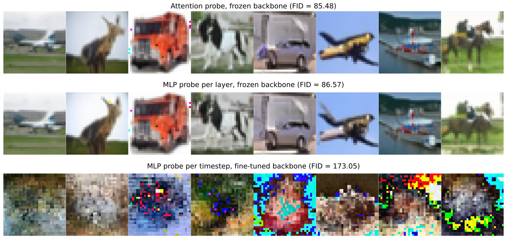
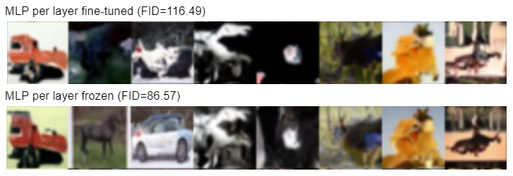
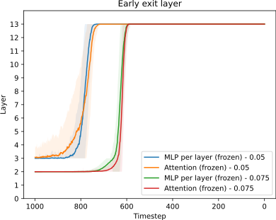
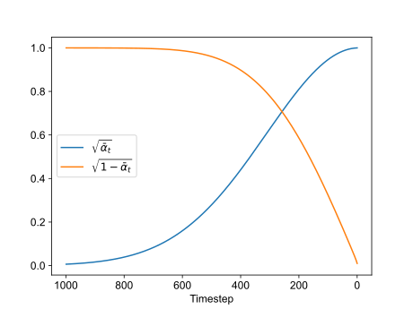
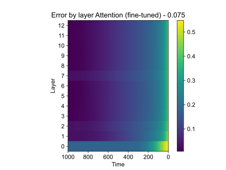
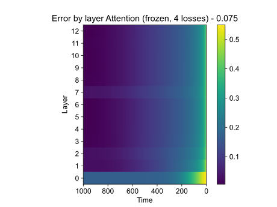
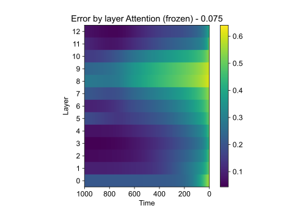
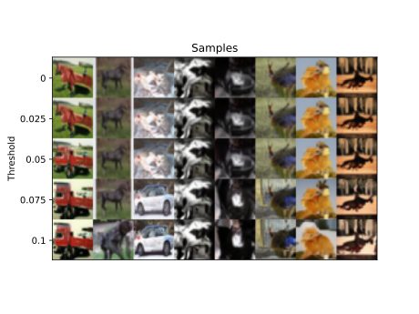

# DeeDiff: Dynamic Uncertainty-Aware Early Exiting For Accelerating Diffusion Model Generation
**D. Gallo, R. Matisan, A. Monroy, J. Partyka, A. Vasilcoiu**

## Introduction

This project delves into and extends upon the discoveries presented in the paper ["DeeDiff: Dynamic Uncertainty-Aware Early Exiting For Accelerating Diffusion Model Generation"](https://arxiv.org/abs/2309.17074). Diffusion models require a large number of iterations to achieve good generation quality, which consequently results in slow inference speed. To address this issue, the authors of DeeDiff propose an early exiting framework aimed to improve the generation speed of diffusion models.  

This blog post aims to achieve 3 objectives:
  1. Provide readers with a thorough understanding of the proposed framework.
  2. Verify the authors' original claims and results through a reproduction of some of their experiments.
  3. Propose extensions on the original model and verify whether these can further improve the generation speed of diffusion models. 

## Background

#### Diffusion models

Diffusion models [1, 3] have achieved great success in image generation, demonstrating superior performance than other generative models like VAEs or GANs. They work by progressively adding random noise to a dataset and then learning to reverse that process to reconstruct the original data. 

In the forward process, noise is incrementally added to a sample $\mathbf{x}_0$ in $T$ timesteps, generating increasingly noisy samples $\mathbf{x}_1, \mathbf{x}_2, ...,  \mathbf{x}_T$ using a Gaussian Markovian diffusion kernel:

$$\begin{align} 
q\left(\mathbf x_t \mid \mathbf x_{t-1} \right) = \mathcal{N}\left( \mathbf x_t ; \sqrt{1-\beta_t} \mathbf x_{t-1}, \beta_t \mathbf{I} \right) & \qquad \qquad \text{(Eq. 1)} 
\end{align}$$

The mean and the variance of the distribution are parametrized with a variance schedule $\beta_t$, which starts close to zero and increases with respect to the timestep.

The reverse process models the distribution of $\mathbf X_{t-1} | \mathbf X_t$, which implies not only representing the marginal distribution of $\mathbf X_0$ but also being able to integrate over it. Thus, it is not possible to calculate the conditional distribution directly, and as such it is approximated with another Gaussian distribution:

$$p_{\boldsymbol{\theta}} \left( \mathbf x_{t-1} \mid \mathbf x_t \right) := \mathcal{N} \left( \mathbf x_{t-1} ; \boldsymbol{\mu}_ {\boldsymbol{\theta}} \left( \mathbf x_t, t \right), \mathbf \Sigma_{\boldsymbol{\theta}} \left( \mathbf x_t, t \right) \right) \qquad \qquad \text{(Eq. 2)}$$

The goal is for $p_{\boldsymbol{\theta}} \left( \mathbf x_{t-1} \mid \mathbf x_t \right)$ to resemble $q\left(\mathbf x_{t - 1} \mid \mathbf x_t, x_0 \right)$. This is accomplished by keeping $\mathbf \Sigma_{\boldsymbol{\theta}} \left( \mathbf x_t, t \right)$ fixed at $\tilde \beta_t \mathbf I$, where $\tilde \beta_t = \frac{1 - \bar \alpha_{t - 1}}{1 - \bar \alpha_t} \beta_t,$ and computing $\boldsymbol \mu_{\boldsymbol{\theta}} \left( \mathbf x_t, t \right)$ from $\boldsymbol{\epsilon}_{\boldsymbol{\theta}} \left( \mathbf x_t, t \right)$, an estimation of the noise that should be added to $\mathbf x_0$ to get $\mathbf x_t$:

$$\begin{align} 
\boldsymbol{\mu_{\boldsymbol{\theta}}} \left( \mathbf x_t, t \right) = \frac{1}{\sqrt{\alpha_t}} \left( \mathbf x_t - \frac{\beta_t}{\sqrt{1 - \bar{\alpha}_ t}} \boldsymbol{\epsilon}_{\boldsymbol{\theta}} \left( \mathbf x_t, t \right) \right) & \qquad \qquad \text{(Eq. 3),}
\end{align}$$

where $\alpha_t = 1 - \beta_t$ and $\bar \alpha_t = \Pi_{i=1}^t \alpha_i$.

During training, the loss is computed as the expectation of the difference between the real $\mathbf \epsilon_t$ noise and its approximation $\boldsymbol \epsilon_{\boldsymbol{\theta}} \left( \mathbf x_t, t \right)$:

$$\mathcal{L}_ {\text{simple}}^{t}(\boldsymbol{\theta}) = \mathbb{E}_ {\mathbf x_0, \boldsymbol \epsilon, t } \left[ \left|| \boldsymbol \epsilon - \boldsymbol \epsilon_{\boldsymbol{\theta}} \left(\mathbf x_t, t \right) \right||_2^2 \right], \text{ where } \mathbf x_t = \sqrt{\bar \alpha_t }\mathbf x_0 + \sqrt{1 - \bar \alpha_t }\boldsymbol \epsilon, \;, \boldsymbol \epsilon \sim \mathcal N(\mathbf 0, \mathbf I) \qquad \qquad \text{(Eq. 4)}$$

Once the model has been trained, sampling can be done following this pseudo-code, which correspond to the DDPM sampling method [1]:

> $\mathbf{x}_ T \sim \mathcal{N}(\mathbf{0}, \mathbf{I})$
> 
> for $t = T, \dots, 1$:
> 
> &nbsp;&nbsp;&nbsp;&nbsp;&nbsp;&nbsp; $\mathbf{z} \sim \mathcal{N}(\mathbf{0}, \mathbf{I})$
> 
> &nbsp;&nbsp;&nbsp;&nbsp;&nbsp;&nbsp; $\mathbf{x}_ {t - 1} = \frac{1}{\sqrt{\alpha_t}} \left(\mathbf{x}_ t - \frac{1 - \alpha_t }{\sqrt{1 - \bar \alpha_t}}\boldsymbol{\epsilon_{\boldsymbol{\theta}}} \left(\mathbf x_t, t \right) \right) + [t > 1] \sqrt{\tilde \beta_t} \mathbf{z}$
> 
> return $\mathbf{x}_{0}$

#### Backbone architectures
In the context of diffusion models, we refer to the architecture used to predict the noise $\boldsymbol{\epsilon}_{\boldsymbol{\theta}} \left( \mathbf x_t, t \right)$ as the backbone architecture. Originally, the most common backbone network used in diffusion models was UNet [4]. However, transformer-based architectures such as U-ViT[2] have demonstrated superior performance in recent years. U-ViT is characterized by treating all inputs (i.e., the timestep and the noisy patch images) as tokens, as well as by employing long skip connections between shallow and deep layers. Beyond simplifying the backbone architecture, UViT-based models have achieved improvements in several other key areas, such as faster sampling, improved training methodology, and more controllable generation [2].

#### Efficiency in Diffusion

Despite their notable performance, generating a high-fidelity sample from a diffusion model is computationally expensive, requiring not only a large number of steps (e.g. 1000 steps) but also considerable computational resources for each step. 

This has motivated a great deal of research aimed at accelerating the inference speed of these models. DDIMs [3] generalize on simple DDPMs, with the same training objective and procedure, but with a deterministic generative process that leads to a sped up by a factor of 10 to even 50. Concurrently, several other works [5, 6, 7] aim to reduce the number of sampling steps by distilling knowledge from a teacher model to a student model with fewer steps.

However, all these methods continue to employ the entire computational capacity of the network for each sampling step, which in the end still incurs low generation speed. 

#### Early-exit strategy

The premise that not all inputs require the same amount of computational resources motivated the exploration of early exiting strategies [8]. These can be defined as general neural network accelerating techniques, allowing the models to selectively exit from hidden layers instead of a full computation when confident enough. 

In the context of classification, for example, one can add intermediate exits in $L$ different layers and compute the predicted label in the following way [8]:

$$
\hat y= \begin{cases} 
\text{arg max } \mathbf{\hat y}_1, & \text{if} & \text{entropy}(\mathbf{\hat y}_1) < \delta_1, \\  
\text{arg max } \mathbf{\hat y}_2, & \text{if} & \text{entropy}(\mathbf{\hat y}_2) < \delta_2,\\ 
& ... & \\
\text{arg max } \mathbf{\hat y}_L, & \text{if} & \text{entropy}(\mathbf{\hat y}_L) < \delta_n.
\end{cases}
$$

where $\mathbf{y}_i$ is vector of class probabilities and $\delta_i$ the exit threshold at exit layer $i$. The entropy function is used here to measure how certain the model is about the classification decision in that layer.

Early-exiting strategies are potentially applicable to improve efficiency in diffusion models, as different denoising steps may demand varying amounts of computation. Nevertheless, traditional early-exit frameworks are not applicable off-the-shelf in the context due to the time-series property and the lack of a natural confidence estimation measure, and thus other modifications are needed. An example of previous work based on this concept is [10], where the authors propose a pre-defined time-dependent exit schedule. 

## DeeDiff model architecture

DeeDiff is built on a difussion model's backbone, such as U-Net or U-ViT. During inference, the output from each transformer layer is fed into an uncertainty estimation module (UEM) to calculate the uncertainty, serving as a proxy for sample difficulty and guiding the early exit decision-making process. Computation at each timestep continues either until the final transformer layer is reached, or until the estimated uncertainty at a certain layer is smaller than a fixed threshold. When the latter occurs, the output of the respective transformer block is passed to an output head, akin to the output head of the base U-ViT model, and the final result is returned. This process is illustrated in Figure 1, which displays the DeeDiff architecture built on top of a UViT Small transformer with 13 layers. This is the architecture we have implemented and used for our experiments.

<table align="center">
  <tr align="center">
      <td></td>
  </tr>
  <tr align="left">
    <td colspan=2><b>Figure 1.</b> DeeDiff architecture integrated in a U-ViT-Small transformer. U-ViT skip connections are ommited for simplicity.</td>
  </tr>
</table>

#### Timestep-aware uncertainty estimation module (UEM)

The authors argue that estimating the noise in each step of diffusion models can be regarded as a regression task, and consider each generation step separately. Namely, for the implementation of the uncertainty estimation networks, they propose a timestep-aware UEM in the form of a fully-connected layer:

$$\begin{align} 
u_{i, t}=f\left(\mathbf{w}_ {t}^{T}\left[L_ {i, t}\right.\right., timesteps \left.]+\mathbf b_ {t}\right), & \qquad \qquad \text{(Eq. 5)} 
\end{align}$$

where $\mathbf w_t$, $\mathbf b_t$, $f$, and $timesteps$ are the weight matrix, weight bias, activation function, and timestep embeddings, respectively.

The pseudo-uncertainty ground truth is constructed as follows:

$$\begin{align} 
\hat{u}_ {i, t}=F\left(\left|\mathbf{g}_ {i}\left(L_{i, t}\right)-\boldsymbol \epsilon_{t}\right|\right), & \qquad \qquad \text{(Eq. 6)} 
\end{align}$$

where $\mathbf{g}_i$ is the output layer, $\epsilon_t$ is the ground truth noise value and $F$ is a function to smooth the output. The authors used $F = \tanh$.

The implementation of the output layer, shown in Figure 2, is inspired on the final layer of the U-ViT architecture. 

<table align="center">
  <tr align="center">
      <td></td>
  </tr>
  <tr align="left">
    <td colspan=2><b>Figure 2.</b> Output head of the DeeDiff architecture, that computes the predicted noise from the output of an intermediate layer of the transformer.</td>
  </tr>
</table>

This brings forth the loss function of this module, designed as the MSE loss of the estimated and pseudo ground truth uncertainty:

$$\begin{align} 
\mathcal{L}_ {u}^{t}=\sum_{i=0}^{N-1}\left\|u_{i, t}-\hat{u}_{i, t}\right\|^{2} & \qquad \qquad \text{(Eq. 7)}
\end{align}$$

During inference, early exit is then achieved by comparing the estimated uncertainty of the output prediction from each layer with a predefined threshold.

#### Uncertainty-aware layer-wise loss

To mitigate the information loss that occurs when not utilizing the full model, the authors also propose an uncertainty-aware layer-wise loss. They draw inspiration from previous work, with one important modification, a weighting term to give more importance to the output layers where the uncertainty is lower (i.e., early exit will happen).

$$\begin{align} 
\mathcal{L}_ {U A L}^{t}=\sum_{i=0}^{N-1}\left(1-u_{i, t}\right) \times\left\|\mathbf{g}_ {i}\left(L_{i, t}\right)-\boldsymbol \epsilon_t\right\|^{2}, & \qquad \qquad \text{(Eq. 8)}
\end{align}$$

where $u_{i, t}$ is the uncertainty value estimated in each layer.

#### Training strategy

DeeDiff utilizes a joint training strategy to balance the effect between uncertainty estimation loss and uncertainty-aware layer-wise loss, added to the orignal diffusion loss:

$$\begin{align} 
\mathcal{L}_ {\text {all }}=\mathcal{L}_ {\text {simple }}^{t}(\boldsymbol{\theta})+\lambda \mathcal{L}_ {u}^{t}+\beta \mathcal{L}_{U A L}^{t}. & \qquad \qquad \text{(Eq. 9)}
\end{align}$$

In their experiments, the authors chose $\lambda = 1$ and $\beta = 1$.

## Analysis of the paper/method

The paper introduces an interesting approach to applying early-exit strategies in diffusion models, which has the potential to significantly improve their inference speed while preserving image generation quality.

The training strategy and the losses are well explained and theoretically motivated. However, a major weakness of the paper is the lack of detailed implementation information regarding the uncertainty estimation module (UEM). As per Equation 5 above, we know that the UEM is implemented as a linear layer. However, this layer is applied independently to each patch, without allowing interaction between patches. In order to make a decision regarding whether to exit or not, uncertainties are aggregated over patches.

Furthermore, the paper lacks an analysis of early-exit trends, such as identifying which layers and timesteps experience more frequent early exits. This analysis is crucial for determining whether the added complexity of early exit in these models is justified or if certain simplifications could be made without compromising performance.

## Novel contributions

We can summarize our novel contributions as follows:
- In response to the previously mentioned limitation of the original UEM in patch processing, we propose an alternative: **using an attention probe**. This is implemented as an attention layer, in which the keys and values are derived from the sequence, and a single query vector is learned. This effectively allows interaction between patches and avoids the need to choose a fixed aggregation function (e.g. sum or max). Figure 3 illustrates both the original implementation (MLP probe), as well our proposed alternative (attention probe). 

<table align="center">
  <tr align="center">
      <td></td>
  </tr>
  <tr align="left">
    <td colspan=2><b>Figure 3.</b> Different implementations of the UEM.</td>
  </tr>
</table>

<!-- As per Equation 5 above, we know that in the original paper, the UEM is implemented as a linear layer. However, this layer is applied independently to each patch, without allowing interaction between patches. Consequently, uncertainties must be aggregated in order to make a decision regarding whether to exit or not. As an alternative, we propose **using an attention probe**. This is implemented as an attention layer, in which the keys and values are derived from the sequence, and a single query vector is learned. This effectively allows interaction between patches and avoids the need to choose a fixed aggregation function (e.g. sum or max). -->
- Regarding the original UEM implementation, we explore three alternatives: an MLP probe per layer, an MLP probe per timestep, and an MLP probe per layer per timestep. 
- We have incorporated a novel **fourth component into the model's loss function**, which consists of the UAL loss from Eq. 8 removing the uncertainty weighting $(1 - u_{i,t})$. The motivation behind this is to prevent the model from potentially learning to produce low-quality outputs and consistently predict "exit", as this behavior would minimize both $\mathcal{L}_ u^t$ and $\mathcal{L}_ \text{UAL}^t$ losses simultaneously. We add this loss as a new term in $\mathcal L_{\text{all}}$ (Eq. 9) with coefficient 1. The analytical expression of this new loss is:
  
$$
\mathcal{L}_ {L}^{t}=\sum_{i=0}^{N-1}\left\|\mathbf{g}_ {i}\left(L_{i, t}\right)- \boldsymbol \epsilon_t\right\|^{2}. \qquad \qquad \text{(Eq. 10)}
$$ 

- Motivated by the potential to reuse already trained diffusion models and enhance their performance, we also explore the possibility of performing early exit on pre-trained models by just fine-tuning the UEMs and projection heads, while keeping the **backbone frozen**.
- We conduct a thorough **investigation into early-exit trends**, to quantify the impact of this technique on the model's overall efficiency. With this, our primary goal is to identify opportunities for optimizing the model architecture, without compromising the added performance benefits.
- As a minor addition, in each time step, we apply the uncertainty estimation module to the inputs, instead of the outputs of each transformer block (including the first one). This ensures that the model is not only able to early exit but to also **skip steps entirely**.

## Experimental setup

We conducted all experiments on the CIFAR-10 dataset, which consists of images with a resolution of 32x32. In alignment with the methodology outlined in the original paper, we use a U-ViT-Small model which consists of 13 layers.

<!-- and which features skip connections between the outputs of layers 1-6 and the inputs of layers 7-13. -->

#### Training strategies
We use the AdamW [11] optimizer with a learning rate of $2 \cdot 10^{-4}$ and a cosine scheduler with a warmup (see our GitHub repo for more details).  

We train different models by employing the following strategies:
- Jointly training the U-ViT, the UEMs and the projection heads from scratch
- Initializing the backbone with pretrained weights, and fine-tuning it while training the UEMs and the projection heads
- Initializing the backbone with pretrained weights, and keeping it frozen while training the UEMs and the projection heads.

For initializing the backbone, we experiment both with available [pre-trained weights](https://github.com/baofff/U-ViT) as well as with training the UViT model ourselves. Following a series of preliminary tests, we established that our weights produce better results overall. Consequently, for all subsequent experiments - except the ones where we jointly train everything from scratch - we used these weights as the starting point.

#### Uncertainty Estimation Modules 

To replicate the experiments in the original paper as closely as possible, we have conducted several experiments with MLP layers as UEMs. The authors mention implementing different UEMs for each time step, however it is unclear if they are also different per layer. Thus, we have implemented 3 different approaches: (1) different MLPs for each timestep (1000 UEMs), (2) different MLPs for each layer (13 UEMs), and (3) different MLPs for each timestep and layer (13000 UEMs). 

<!-- For the implementation of the MLP itself, we experiment with 2 approaches. The first one, as suggested in the original paper, is to apply the MLP on the third input dimension (embedding dimension) and to aggregate with a mean on the second dimension (number of patches), while the second one is the other way around (applying the MLP on the second dimension and aggregating on the third).  -->

Furthermore, we also experiment with our proposed attention probe, having one for each layer that is shared over timesteps.

#### Evaluation

To evaluate our models comprehensively, we assess both the quality of the generated images and the performance enhancement achieved through early exiting, with the goal of identifying optimal strategies that reduce inference time while maintaining image fidelity. To calculate each metric, we generate 1024 images from each model in batches of size 128, with an early-exit threshold of 0.075.

On the one hand, we test the quality of generated samples through FID score, which provides a robust measure of image quality in comparison to the simple UViT baseline.

<!-- For the qualitative analysis, we use the generated images to perform a visual inspection and report the FID score, providing  -->

Furthermore, to quantify the efficiency gains, we calculate and report the average layer ratio and average theoretical GFLOPs. The layer ratio is presented as follows: in the baseline, without early exit, the layer ratio is 1, indicating full utilization of all model layers. With early exit, the total number of layers decreases, and as such we report this reduction as a negative percentage, denoted as "-x%", where "x" signifies the proportion of layers bypassed in the computation. Additionally, we calculate the theoretical GFLOPs for each model forward pass at every timestep and for each generated sample. At the same time, we determine the GFLOPs used on each individual components of the architecture (i.e., attention probe, MLP probe, output head).

<!-- To qualitatively assess the generated images, we chose the CMMD metric [9], an improvement over the widely-used FID metric featured in the original DeeDiff paper. While FID is popular, it has several limitations, such as not reflecting gradual improvement, not capturing distortion levels, and producing inconsistent results across varying sample sizes. CMMD, on the other hand, addresses these limitations and provides a more robust and reliable assessment of image quality. However, our decision to use CMMD was primarily driven by practical considerations. Constrained by time and resources, we couldn't generate the large number of images required for an accurate FID evaluation, making CMMD a more feasible option. -->

## Results

### Performance and image quality

As detailed in the Evaluation section, our reporting includes FID scores, average layer ratio, and GFLOPs for our models, conveniently presented in Table 1.

<table><thead>
  <tr>
    <th>Model</th>
    <th>Classif. head</th>
    <th>Backbone</th>
    <th>FID</th>
    <th>Layer ratio reduction</th>
    <th>Average GFLOPs</th>
  </tr></thead>
<tbody>
   <tr>
    <td>UViT (baseline)</td>
    <td>-</td>
    <td>-</td>
    <td>79.34</td>
    <td>1</td>
    <td>22.75</td>
  </tr>
  <tr>
    <td rowspan="7">DeeDiff (MLP probe)</td>
    <td rowspan="3">Per layer</td>
    <td>Frozen</td>
    <td>86.57</td>
    <td>-31.1%</td>
    <td>15.58</td>
  </tr>
  <tr>
    <td>Fine-tuned</td>
    <td>116.49</td>
    <td>-42.3%</td>
    <td>13.05</td>
  </tr>
  <tr>
    <td>Trained from scratch</td>
    <td>125.15</td>
    <td>-39.32%</td>
    <td>13.74</td>
  </tr>
  <tr>
    <td rowspan="2">Per timestep</td>
    <td>Frozen</td>
    <td>79.13</td>
    <td>-0.1%</td>
    <td>22.74</td>
  </tr>
  <tr>
    <td>Fine-tuned</td>
    <td>173.05</td>
    <td>-35%</td>
    <td>14.67</td>
  </tr>
  <tr>
    <td rowspan="2">Per layer per timestep</td>
    <td>Frozen</td>
    <td>79.13</td>
    <td>1</td>
    <td>22.75</td>
  </tr>
  <tr>
    <td>Fine-tuned</td>
    <td>133.35</td>
    <td>-35.3%</td>
    <td>14.68</td>
  </tr>
  <tr>
    <td rowspan="3">DeeDiff (attention probe)</td>
    <td rowspan="3">Per layer</td>
    <td>Frozen</td>
    <td>85.48</td>
    <td>-32%</td>
    <td>17.84</td>
  </tr>
  <tr>
    <td>Fine-tuned</td>
    <td>109.83</td>
    <td>-40%</td>
    <td>15.77</td>
  </tr>
  <tr>
    <td>Trained from scratch</td>
    <td>114.62</td>
    <td>-40%</td>
    <td>15.80</td>
  </tr>
</tbody>
  <tr align="left">
    <td colspan=7><b>Table 1.</b> Quality and speed results for image generation with DeeDiff using U-ViT-Small as backbone. We used the same threshold of 0.075 for all methods.
  </tr>
  </table>
  
#### Ablation 1: Implementation of the UEM module

We conducted experiments to analyze the impact of different implementations of the UEM module. Contrary to the original paper, where the authors exclusively propose different MLPs per timestep, we observe that MLP per timestep yields the least favorable results. As depicted in Table 1, with a frozen backbone, the model performs virtually no early exiting. With a fine-tuned backbone, it records the highest FID score, with a 2.18x increase compared to the baseline, accompanied by visually poor quality in the generated images upon manual inspection. MLP per timestep per layer performs in a similar fashion. Consequently, our findings highlight our inability to replicate the original results under our experimental conditions.

In contrast, the other two types, namely MLP per layer and our novel attention probe, demonstrate much better behaviour. They both exhibit only a slight decrease in image quality from the baseline, with a layer ratio reduction of 31.1% and 32% respectively when freezing the backbone.

Figure 4 provides a visualization of the difference between the best and worst performing models with respect to the FID score, namely the attention probe with a frozen backbone and the MLP per timestep with a fine-tuned backbone.

<table align="center">
  <tr align="center">
      <td></td>
  </tr>
  <tr align="left">
    <td colspan=2><b>Figure 4.</b> Image quality comparison between worst and best models with respect to the FID score. We used the same threshold of 0.075 for both methods. </td>
  </tr>
</table>

However, the attention probe increases the latency during sampling as compared to the MLP probe. Table 2 illustrates a comparison of the two types of classifiers, as well as the output head in terms of number of inference GFLOPs. The difference between the two probes is significant and could impact the overall performance of the model unless it frequently early exits at multiple timesteps.

<table class="tg"><thead>
  <tr>
    <th class="tg-0pky">Individual component </th>
    <th class="tg-0pky">Theoretical GFlops</th>
  </tr></thead>
<tbody>
  <tr>
    <td class="tg-0pky">Attention Probe</td>
    <td class="tg-dvpl">0.26</td>
  </tr>
  <tr>
    <td class="tg-0pky">MLP Probe</td>
    <td class="tg-dvpl">0.0002</td>
  </tr>
  <tr>
    <td class="tg-0pky">Output Head</td>
    <td class="tg-dvpl">0.0035</td>
  </tr>
  
<tr align="left">
    <td colspan=7><b>Table 2.</b> Number of GFlops for each individual component of the DeeDiff model when running a forward pass. We can observe the attention probe brings significantly more latency to the model as compared to the MLP probe.
  </tr>
</tbody>
</table>

Therefore, we conclude that adopting a single UEM for each layer, shared across all timesteps, represents the optimal approach. We acknowledge that the attention probe yields the best overall results in our limited experimental set-up, however at a significat added latency to the model. Further experiments with different thresholds and different datasets are warranted to generalize over which UEM module has the best performance.

#### Ablation 2: Freezing the backbone vs fine-tuning vs training from scratch

Across all types of UEMs, we note a greater layer ratio reduction for the fine-tuned models, however at the expense of significant degradation in image quality. For example, with the MLP per layer configuration, the fine-tuned model achieves a 42.3% layer reduction and records a FID score of 116.49, whereas with a frozen backbone, the reduction is only 31.1%, yet the FID score remains much closer to the baseline at 86.75. The difference in image quality for these two models can be visualized in Figure 5.

<table align="center">
  <tr align="center">
      <td></td>
  </tr>
  <tr align="left">
    <td colspan=2><b>Figure 5.</b> Comparison between images generated from models with MLP per layer, with a fine-tuned and a frozen backbone, and a fixed threshold of 0.075. </td>
  </tr>
</table>

We also compare models initialized with pre-trained weights versus models where the backbone is trained from scratch together with the other modules. We perform this experiment for the MLP per layer and the attention probe. In both cases, we observe that the models trained from scratch result in higher FID scores, with an increase of 44.55% for the MLP, and 34.09% for the attention probe respectively. Furthermore, the models trained from scratch do not achieve a better layer ratio reduction, therefore we conclude that initializing the backbone with pre-trained weights works best.

#### Ablation 3: Addition of unweighted layer-wise loss

To investigate the impact of the unweighted layer-wise loss component, we chose to evaluate two models, namely the ones based on an MLP per layer and attention probe UEMs with fine-tuned backbones. Table 3 includes the previous results for these models trained with only 3 losses, and adds the results of the models trained with 4 losses.

<table><thead>
  <tr>
    <th>Model</th>
    <th>Classif. head</th>
    <th>Backbone</th>
    <th>FID</th>
    <th>Layer ratio reduction</th>
    <th>Average GFLOPs</th>
  </tr></thead>
<tbody>
  <tr>
    <td rowspan="2">MLP</td>
    <td rowspan="2">Per layer</td>
    <td>3 losses</td>
    <td>116.49</td>
    <td>-42.3%</td>
    <td>13.05</td>
  </tr>
  <tr>
    <td>4 losses</td>
    <td>107.34</td>
    <td>-42.3%</td>
    <td>13.07</td>
  </tr>
  <tr>
    <td rowspan="2">Attention probe</td>
    <td rowspan="2">Per layer</td>
    <td>3 losses</td>
    <td>109.83</td>
    <td>-40%</td>
    <td>15.77</td>
  </tr>
  <tr>
    <td>4 losses</td>
    <td>108.30</td>
    <td>-42.5%</td>
    <td>15.13</td>
  </tr>
</tbody>
  <tr align="left">
    <td colspan=7><b>Table 3.</b> Quality and speed results for image generation with DeeDiff using U-ViT-Small as backbone for MLP per layer and attention probe based models, with 3 and 4 loss components respectively.
  </tr>
  </table>
  
As previously explained, we introduced this novel forth component to the loss to prevent the model from potentially learning to produce only low-quality outputs with high uncertainties. While we do observe a modest enhancement with this new loss component, the magnitude of improvement is insufficient to assert that the fourth loss solves this issue (or even that this issue is limiting the performance of the model). 

### Early-exit trends

#### Early-exit layers

Regardless of training strategy or UEM implementation, we observe a similar trend with respect to early exiting, namely that the models exit very early in the first time steps of the reverse diffusion process, while they require (almost) full computation for the last steps. This behavior can be observed in Figure 6.

<table align="center">
  <tr align="center">
      <td></td>
  </tr>
  <tr align="left">
    <td colspan=2><b>Figure 6.</b> Early-exit layer per timestep for different thresholds and UEM implementations. Results are averaged over 1024 sampled images. </td>
  </tr>
</table>

This makes sense because the model is trained with $\mathbf{x}_t = \sqrt{\bar \alpha_t} \mathbf{x}_0 + \sqrt{1 - \bar \alpha _t} \boldsymbol \epsilon_t$ and, at inference, it has to predict $\boldsymbol \epsilon_t$. When $t$ is large, $\sqrt{\bar \alpha_t}$ will be very small and $\sqrt{1 - \bar \alpha _t}$ will be close to one (see Figure 7), so the model just has to act close to the identity!

<table align="center">
  <tr align="center">
      <td></td>
  </tr>
  <tr align="left">
    <td colspan=2><b>Figure 7.</b> Evolution of Diffusion coefficients across sampling timesteps. </td>
  </tr>
</table>

Figure 8 further explains this. Our intuition is that in the first sampling steps, the model finds it easier to predict the noise from a very noisy image, while it becomes increasingly harder to identify the noise in the last steps, as the image's distribution is further from the noise's.

<table align="center">
  <tr align="center">
      <td></td>
  </tr>
  <tr align="left">
    <td colspan=2><b>Figure 8.</b> Example of input and expected output of the backbone architecture for different timesteps. </td>
  </tr>
</table>

#### Classifier outputs
In addition to investigating the layers where early exiting is performed, we also looked into the UEM outputs computed for every layer and timestep. We analyize three scenarios in Figure 9: (1) using a frozen backbone with an attention probe, (2) fine-tuning the backbone and the attention probe together, and (3) using a frozen backbone with an attention probe (using as objective all four losses). Even though one would expect some kind of monotonicity (i.e., an uncertainty that decreases as we move to deeper layers) that only happens when we fine-tune the model, train it from scratch, or add our fourth loss. On the contrary, if we keep the backbone frozen, we see that the uncertainty increases after the middle layer, which is precisely where the initial layers are added via the skip connections.

<table align="center">
  <tr align="center">
      <td></td>
      <td></td>
      <td></td>
  </tr>
  <tr align="left">
    <td colspan=3><b>Figure 9.</b> UEM outputs over layers and timesteps. Results are averaged over 1024 samples.</td>
  </tr>
</table>

#### Influence of the threshold

Lastly, we also investigate the impact on image quality based on different threshold. As can be seen in Figure 10, we observe that early-exit thresholds between 0 and 0.05 don't alter the image quality significantly, while thresholds larger than 0.075, which allow early-exit more permissively, result in considerable alterations.

<table align="center">
  <tr align="center">
      <td></td>
  </tr>
  <tr align="left">
    <td colspan=2><b>Figure 10.</b> Images generated from models with different early-exit thresholds. DeeDif with attention trained with a frozen backbone was used to generate the images. </td>
  </tr>
</table>

Furthermore, we compare results obtained with thresholds 0.05 and 0.075 for our best performing models, namely with MLP per layer and attention probe as UEMs, and a frozen backbone.

<table><thead>
  <tr>
    <th>Model</th>
    <th>Classif. head</th>
    <th>Threshold</th>
    <th>FID</th>
    <th>Layer ratio reduction</th>
    <th>Average GFLOPs</th>
  </tr></thead>
<tbody>
  <tr>
    <td rowspan="2">MLP</td>
    <td rowspan="2">Per layer</td>
    <td>0.05</td>
    <td>79.71</td>
    <td>-16.54%</td>
    <td>18.90</td>
  </tr>
  <tr>
    <td>0.075</td>
    <td>86.57</td>
    <td>-31.1%</td>
    <td>15.58</td>
  </tr>
  <tr>
    <td rowspan="2">Attention probe</td>
    <td rowspan="2">Per layer</td>
    <td>0.05</td>
    <td>80.08</td>
    <td>-16.29%</td>
    <td>21.91</td>
  </tr>
  <tr>
    <td>0.075</td>
    <td>85.48</td>
    <td>-32%</td>
    <td>17.84</td>
  </tr>
</tbody>
  <tr align="left">
    <td colspan=7><b>Table 4.</b> Quality and speed results for image generation with DeeDiff using U-ViT-Small as backbone for MLP per layer and attention probe based models, with a frozen backbone.
  </tr>
  </table>

The results in Table 4 align with our expectations, demonstrating that a lower threshold enhances image quality. However, this improvement comes at the cost of increased computational demand, resulting in fewer instances of early exiting. This finding highlights the necessity of not only a more refined, and potentially adaptive threshold, but also the inevitable trade-off between quality and performance, necessitating careful consideration based on specific needs and constraints.

As a final observation, it is notable that despite allowing the model to skip entire timesteps, i.e., early exit before going through the first transformer block (layer 0 in the plots), we have hardly ever observed this behaviour in our experiments. Figure 6 illustrates that this phenomenon only manifests in the initial timesteps for a threshold of 0.1, which, as evidenced in Figure 10, fails to adequately maintain image quality.

## Further research
For future research, we aim to address the time and resource constraints encountered during the project and, consequently, conduct additional experiments. This includes (1) experimenting with other datasets featuring higher resolution images, such as CelebA or ImageNet, (2) experimenting with a larger subset of early-exit thresholds and (3) reporting more accurate FID scores based on a larger number of generated images.

Moreover, we intend to explore improvements over the proposed technique to further reduce the computation especially in later sampling steps, and not just mainly in the earlier steps.

Lastly, we plan to conduct experiments using fewer uncertainty estimation modules, for example only two instead of one for each layer. This follows naturally from the early-exit trends observed in our previous experiments.

## Conclusion

In this blog post, we have thoroughly analyzed the paper "DeeDiff: Dynamic Uncertainty-Aware Early Exiting For Accelerating Diffusion Model Generation", identifying the strengths and weaknesses of the original work, as well as proposing novel contributions that address these weaknesses. Our contributions include, but are not limited to, proposing alternative implementations of the UEM, introducing a new loss component to prevent potential issues in model learning, and exploring the feasibility of early-exit on pre-trained frozen backbones. We conducted comprehensive experiments to evaluate the impact of our proposed modifications on image generation quality and efficiency gains.

We found that adopting a single UEM per layer, shared across all timesteps, represents an optimal approach. Additionally, freezing the backbone during fine-tuning of the uncertainty estimation and projection heads leads to better image quality compared to fine-tuning everything, albeit with a slight sacrifice in efficiency gains. 

Our investigation into early-exit trends is probably our bigger contribution, as we show that early-exit only happens in almost-trivial cases. It would be desirable to make the model early-exit in a wider variety of layers across all timesteps.

Overall, our work provides valuable insights into accelerating the inference of diffusion models while maintaining high-quality image generation, contributing to the ongoing research in this domain. 

## Contributions
- Daniel: early-exit model implementation and visualizations, sampling.
- Razvan: DeeDiff loss functions implementation, benchmarking, ablations related to linear/attention probes, visualizations.
- Alejandro: sampling, blogpost, poster.
- Janusz: training loop, checkpointing, README.
- Ana: DeeDiff loss functions implementation, CMMD/FID and layer ratio analysis, blogpost.

_Note: we took the [U-ViT repository](https://github.com/baofff/U-ViT) and some base code provided by our TA (Tin Hadži) as inspiration for the implementation of the backbone model (U-ViT-Small). The rest of the implementation was developed by us._

## Bibliography
[1] Ho, Jonathan, Ajay Jain, and Pieter Abbeel. "Denoising diffusion probabilistic models." Advances in neural information processing systems 33 (2020): 6840-6851.

[2] Bao, Fan, et al. "All are worth words: A vit backbone for diffusion models." Proceedings of the IEEE/CVF Conference on Computer Vision and Pattern Recognition. 2023.

[3] Song, Jiaming, Chenlin Meng, and Stefano Ermon. "Denoising diffusion implicit models." arXiv preprint arXiv:2010.02502 (2020).

[4] Ronneberger, Olaf., Phillip Fischer and Thomas Brox, "U-net: Convolutional networks for biomedical image segmentation". Medical image computing and computer-assisted intervention–MICCAI (2015).

[5] Luhman, Eric, and Troy Luhman. "Knowledge distillation in iterative generative models for improved sampling speed." arXiv preprint arXiv:2101.02388 (2021).

[6] Salimans, Tim, and Jonathan Ho. "Progressive distillation for fast sampling of diffusion models." arXiv preprint arXiv:2202.00512 (2022).

[7] Meng, Chenlin, et al. "On distillation of guided diffusion models." Proceedings of the IEEE/CVF Conference on Computer Vision and Pattern Recognition. 2023.

[8] Teerapittayanon, Surat, Bradley McDanel, and Hsiang-Tsung Kung. "Branchynet: Fast inference via early exiting from deep neural networks." 2016 23rd international conference on pattern recognition (ICPR). IEEE, 2016.

[9] Jayasumana, Sadeep, et al. "Rethinking fid: Towards a better evaluation metric for image generation." arXiv preprint arXiv:2401.09603 (2023).

[10] Moon, Taehong, et al. "Early exiting for accelerated inference in diffusion models." ICML 2023 Workshop on Structured Probabilistic Inference {\&} Generative Modeling (2023).

[11] Loshchilov, Ilya, and Frank Hutter. "Decoupled weight decay regularization." arXiv preprint arXiv:1711.05101 (2017).

[12] Strümke, Inga, and Helge Langseth. "Lecture Notes in Probabilistic Diffusion Models." arXiv preprint arXiv:2312.10393 (2023).
